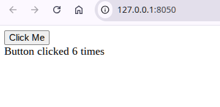
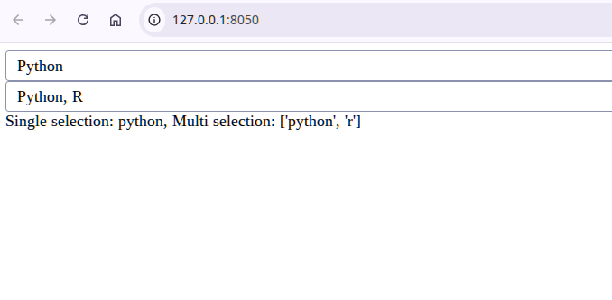
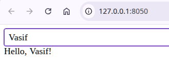

# Dash Core Components Overview

## Introduction

This section will introduce you to the core components of Dash, which are the building blocks for creating interactive web applications. Dash provides a wide range of components that allow you to create various types of user interfaces, including buttons, dropdowns, sliders, input fields, and more. In this lesson, we will explore the most commonly used core components in Dash and how to use them effectively in your applications. 

## Dash Core Components

Dash Core Components are a set of pre-built components that come with the Dash library. These components are designed to be flexible and customizable, allowing you to create a wide variety of user interfaces. Some of the most commonly used core components include: 

### **Button**:

 A simple button component that can be used to trigger actions or events in your application. You can customize the appearance and behavior of the button using various properties such as `n_clicks`, `disabled`, and `style`. The `n_clicks` property keeps track of the number of times the button has been clicked, which can be useful for triggering callbacks based on user interactions. The `disabled` property can be used to disable the button, preventing users from clicking it, while the `style` property allows you to customize the appearance of the button using CSS styles. If you want to create a button that triggers a callback when clicked, you can use the `n_clicks` property to track the number of clicks and use it as an input in your callback function. For example, you can create a button that increments a counter each time it is clicked, and then display the updated count in your application.

For example, you can create a button that increments a counter each time it is clicked, and then display the updated count in your application. Here's a simple example of how to use the `Button` component in Dash:

<details>
<summary>Click to expand the code example</summary>

```python
import dash
from dash import html, dcc
from dash.dependencies import Input, Output

app = dash.Dash(__name__)
app.layout = html.Div([
    html.Button('Click Me', id='my-button', n_clicks=0),
    html.Div(id='output')
])

# we will learn callbacks in the next lessons
@app.callback(
    Output('output', 'children'),
    Input('my-button', 'n_clicks')
)
def update_output(n_clicks):
    return f'Button clicked {n_clicks} times'  

if __name__ == '__main__':
    app.run(debug=True)
```

</details>

In this example, we have a button with the ID `my-button` and an output div with the ID `output`. The callback function `update_output` takes the number of clicks from the button as input and updates the output div to display how many times the button has been clicked.

**Result:**

<figure>
    
    <figcaption align="center"><b>Figure 1:</b> A screenshot showing a Dash app with a button clicked 6 times.</figcaption>
</figure>


###  **Dropdown** 

 A dropdown component that allows users to select one or more options from a list. You can customize the options, appearance, and behavior of the dropdown using properties such as `options`, `value`, and `multi`. The `options` property is used to define the list of options available in the dropdown, while the `value` property holds the currently selected value(s). If you set `multi=True`, users can select multiple options from the dropdown, and the `value` property will return a list of selected values. For example, you can create a dropdown that allows users to select their favorite fruits, and then display the selected fruits in your application. Here's an example of how to use the `Dropdown` component in Dash. We will create two dropdowns, one for single selection and another for multi-selection, and display the selected values in the output div.

<details>
<summary>Click to expand the code example</summary>

```python
import dash
from dash import html, dcc
from dash.dependencies import Input, Output 

app = dash.Dash(__name__)
app.layout = html.Div([
    dcc.Dropdown(
        id='single-dropdown',
        options=[
            {'label': 'Python', 'value': 'python'},
            {'label': 'R', 'value': 'r'},
            {'label': 'Java', 'value': 'java'}
        ],
        value='python'  # default value
    ),
    dcc.Dropdown(
        id='multi-dropdown',
        options=[
            {'label': 'Python', 'value': 'python'},
            {'label': 'R', 'value': 'r'},
            {'label': 'Java', 'value': 'java'}
        ],
        multi=True  # allow multiple selection
    ),
    html.Div(id='output')
])

@app.callback(
    Output('output', 'children'),
    [Input('single-dropdown', 'value'),
     Input('multi-dropdown', 'value')]
)
def update_output(single_value, multi_values):
    return f'Single selection: {single_value}, Multi selection: {multi_values}' 

if __name__ == '__main__':
    app.run(debug=True)
```

</details>

In this example, we have two dropdowns: `single-dropdown` for single selection and `multi-dropdown` for multiple selection. The callback function `update_output` takes the selected values from both dropdowns as input and updates the output div to display the selected values. When you run this code, you will see two dropdowns in your Dash application. The first dropdown allows you to select a single programming language, while the second dropdown allows you to select multiple programming languages. The output div will display the selected values from both dropdowns.

**Result:**

<figure>
    
    <figcaption align="center"><b>Figure 2:</b> A screenshot showing a Dash app with a single selection dropdown and a multi-selection dropdown, displaying the selected values.</figcaption>
</figure>


### **Input** 

An input component that allows users to enter text or numbers. You can customize the appearance and behavior of the input field using properties such as `value`, `type`, and `placeholder`. The `value` property holds the current value of the input field, while the `type` property can be set to specify the type of input (e.g., 'text', 'number', 'password'). The `placeholder` property allows you to provide a hint to the user about what kind of input is expected. For example, you can create an input field for users to enter their name, and then display a greeting message based on the entered name. Here's an example of how to use the `Input` component in Dash:

<details>
<summary>Click to expand the code example</summary>

```python
import dash
from dash import html, dcc
from dash.dependencies import Input, Output 

app = dash.Dash(__name__)
app.layout = html.Div([
    dcc.Input(
        id='name-input',
        type='text',
        placeholder='Enter your name'
    ),
    html.Div(id='output')
])

@app.callback(
    Output('output', 'children'),
    Input('name-input', 'value')
)
def update_output(name):
    if name:
        return f'Hello, {name}!'
    return 'Please enter your name.'    

if __name__ == '__main__':
    app.run(debug=True)
```

</details>

**Result:**

<figure>
    
    <figcaption align="center"><b>Figure 3:</b> A screenshot showing a Dash app with an input field for entering a name, and a greeting message displayed based on the entered name.</figcaption>
</figure>

!!!note
    From now on, we will not be providing the images for the output of the code examples, but you can easily run the code snippets in your local environment to see the results. This will also give you hands-on experience with Dash and help you understand how the components work in practice.

### **Slider** 

 A slider component that allows users to select a value from a range by dragging a handle along a track. You can customize the appearance and behavior of the slider using properties such as `min`, `max`, `step`, and `value`. The `min` and `max` properties define the range of values for the slider, while the `step` property specifies the increment between values. The `value` property holds the current value of the slider. For example, you can create a slider that allows users to select their age, and then display a message based on the selected age. Here's an example of how to use the `Slider` component in Dash:

<details>
<summary>Click to expand the code example</summary>

```python
import dash
from dash import html, dcc
from dash.dependencies import Input, Output 

app = dash.Dash(__name__)
app.layout = html.Div([
    dcc.Slider(
        id='age-slider',
        min=0,
        max=100,
        step=1,
        value=25
    ),
    html.Div(id='output')
])

@app.callback(
    Output('output', 'children'),
    Input('age-slider', 'value')
)
def update_output(age):
    return f'You are {age} years old.'

if __name__ == '__main__':
    app.run(debug=True)
```

</details>


### Displaying Areas and Graphs

In addition to the input components we have covered so far, Dash also provides components for displaying output, such as `html.Div` for displaying text and `dcc.Graph` for displaying interactive graphs. The `html.Div` component can be used to display any text or HTML content, while the `dcc.Graph` component allows you to create interactive graphs using Plotly. You can customize the appearance and behavior of these components using various properties. For example, you can create a graph that updates based on user input from a slider or dropdown. Here's an example of how to use the `dcc.Graph` component in Dash:

<details>
<summary>Click to expand the code example</summary>

```python
import dash
from dash import html, dcc
from dash.dependencies import Input, Output
import plotly.express as px

app = dash.Dash(__name__)
app.layout = html.Div([
    dcc.Slider(
        id='age-slider',
        min=0,
        max=100,
        step=1,
        value=25
    ),
    dcc.Graph(id='age-graph')
])

@app.callback(
    Output('age-graph', 'figure'),
    Input('age-slider', 'value')
)
def update_graph(age):
    df = px.data.iris()  # using a sample dataset for demonstration
    fig = px.scatter(df, x='sepal_width', y='sepal_length',
                     size='petal_length', color='species',
                     title=f'Age: {age}')
    return fig

if __name__ == '__main__':
    app.run(debug=True)
```

</details>

This example creates a slider that allows users to select an age, and a graph that updates based on the selected age. The graph uses the Iris dataset as a sample dataset for demonstration purposes. When you run this code, you will see a slider and an interactive graph in your Dash application. As you move the slider, the title of the graph will update to reflect the selected age.


### Filtering 

Dash also provides components for filtering data, such as `dcc.Checklist` and `dcc.RadioItems`. The `dcc.Checklist` component allows users to select multiple options from a list of checkboxes, while the `dcc.RadioItems` component allows users to select a single option from a list of radio buttons. You can use these components to filter data displayed in a graph or table based on user selections. For example, you can create a checklist that allows users to select which categories of data they want to display in a graph. Here's an example of how to use the `dcc.Checklist` component in Dash:

<details>
<summary>Click to expand the code example</summary>

```python
import dash
from dash import html, dcc
from dash.dependencies import Input, Output
import plotly.express as px

app = dash.Dash(__name__)
app.layout = html.Div([
    dcc.Checklist(
        id='category-checklist',
        options=[
            {'label': 'Category A', 'value': 'A'},
            {'label': 'Category B', 'value': 'B'},
            {'label': 'Category C', 'value': 'C'}
        ],
        value=['A', 'B']  # default selected categories
    ),
    dcc.Graph(id='category-graph')
])

@app.callback(
    Output('category-graph', 'figure'),
    Input('category-checklist', 'value')
)
# selected_categories is a list of selected categories from the checklist
def update_graph(selected_categories):
    df = px.data.iris()  # using a sample dataset for demonstration
    df['category'] = df['species'].apply(lambda x: 'A' if x == 'setosa' else ('B' if x == 'versicolor' else 'C'))
    filtered_df = df[df['category'].isin(selected_categories)]
    fig = px.scatter(filtered_df, x='sepal_width', y='sepal_length',
                     size='petal_length', color='species',
                     title=f'Selected Categories: {", ".join(selected_categories)}')
    return fig

if __name__ == '__main__':
    app.run(debug=True)
```

</details>

In the above example, we have a checklist that allows users to select which categories of data they want to display in the graph. The callback function `update_graph` takes the selected categories from the checklist as input, filters the dataset based on the selected categories, and updates the graph accordingly. The function understand what are the input `selected_categories` , because it is defined as an input in the callback decorator, and it will receive the current value of the checklist whenever it changes. So, the `selected_categories` variable is just a placeholder name for the input value, and you can name it anything you want. The important part is that it will store the values selected in the checklist, which can then be used to filter the data and update the graph.

### Store 

The `dcc.Store` component is used to store data in the browser's memory. This can be useful for sharing data between callbacks or for persisting data across page reloads. The `dcc.Store` component has a `data` property that can hold any serializable data, such as dictionaries, lists, or strings. You can use this component to store intermediate results or user selections that need to be accessed by multiple callbacks. For example, you can use `dcc.Store` to store the selected values from a dropdown and then access those values in another callback to update a graph or table based on the stored selections. 

I will give two scenarios where you must use `dcc.Store` component in your Dash application.

1. **Scenario 1: Sharing Data Between Callbacks:** Suppose you have a dropdown where users can select a category, and based on that selection, you want to update both a graph and a table. Instead of passing the selected category directly from the dropdown to both callbacks, you can use `dcc.Store` to store the selected category and then access it in both callbacks. This way, you can avoid redundant code and keep your callbacks more organized.

2. **Scenario 2: Persisting Data Across Page Reloads:** If you want to allow users to save their selections or preferences and have them persist even after they reload the page, you can use `dcc.Store` with the `storage_type` property set to 'local' or 'session'. This will store the data in the browser's local storage or session storage, allowing it to persist across page reloads. For example, you can store a user's theme preference (light or dark mode) in `dcc.Store`, and when the user reloads the page, you can retrieve that preference and apply the appropriate theme. 

We will cover the `dcc.Store` component in more detail in the next phases of this roadmap, where we will discuss state and data management in Dash applications. We will explore how to use `dcc.Store` effectively to manage application state and share data between callbacks, as well as best practices for using it in your Dash applications.


### Loading and Downloading

Dash also provides components for handling file uploads and downloads, such as `dcc.Upload` and `dcc.Download`. The `dcc.Upload` component allows users to upload files to the server, while the `dcc.Download` component allows users to download files from the server. You can use these components to enable file handling functionality in your Dash applications. For example, you can create an upload component that allows users to upload a CSV file, and then display the contents of the file in a table or graph. Similarly, you can create a download component that allows users to download a generated report or dataset from your application. Here's a simple example of how to use the `dcc.Upload` component in Dash:

<details>
<summary>Click to expand the code example</summary>

```python
import dash
from dash import html, dcc
from dash.dependencies import Input, Output
import pandas as pd
import io

app = dash.Dash(__name__)
app.layout = html.Div([
    dcc.Upload(
        id='upload-data',
        children=html.Div([
            'Drag and Drop or ',
            html.A('Select Files')
        ]),
        style={
            'width': '100%',
            'height': '60px',
            'lineHeight': '60px',
            'borderWidth': '1px',
            'borderStyle': 'dashed',
            'borderRadius': '5px',
            'textAlign': 'center',
            'margin': '10px'
        },
        multiple=False  # allow only single file upload
    ),
    html.Div(id='output-data-upload')
])  

@app.callback(
    Output('output-data-upload', 'children'),
    Input('upload-data', 'contents'), # contents of the uploaded file
    Input('upload-data', 'filename') # name of the uploaded file
)
def update_output(contents, filename):
    if contents is not None:
        # split the contents into content type and content string
        # content type is the type of the uploaded file (e.g., 'text/csv'), and 
        # content string is the actual content of the file encoded in base64
        content_type, content_string = contents.split(',')  

        # decode the content string from base64 and read it into a pandas dataframe
        decoded = io.BytesIO(base64.b64decode(content_string))
        df = pd.read_csv(decoded)  # assuming the uploaded file is a CSV

        # this time the graph is created inside the callback function, and it will update based on the uploaded file
        return html.Div([
            html.H5(filename),
            dcc.Graph(
                figure={
                    'data': [
                        {'x': df[df.columns[0]], 'y': df[df.columns[1]], 'type': 'scatter', 'mode': 'markers'}
                    ],
                    'layout': {
                        'title': 'Uploaded Data Visualization'
                    }
                }
            )
        ])
    return 'Please upload a file.'

if __name__ == '__main__':
    app.run(debug=True)
```

</details>

In this example, we have an upload component that allows users to upload a CSV file. The callback function `update_output` takes the contents and filename of the uploaded file as input, decodes the contents, reads it into a pandas dataframe, and then creates a graph based on the uploaded data. The variables ``contents`` and ``filename`` are automatically provided by the `dcc.Upload` component and will contain the content and name of the uploaded file, respectively. You can use these variables in your callback function to process the uploaded file and update your application accordingly.

This time, the layout of graph is created inside the callback function, and it will update based on the uploaded file. We did not create the graph in the main layout of the application, because we want the graph to be dynamic and update based on the uploaded file. If you create the graph in the main layout, it will not update when a new file is uploaded, and it will only display the initial graph that you created. By creating the graph inside the callback function, you can ensure that it updates dynamically based on the uploaded file, allowing for a more interactive and responsive user experience. So, we cleared out one important thing: **dynamic contents including any type of things such as graphs, tables, text, etc. should be created inside the callback function, and not in the main layout of the application.** This way, you can ensure that the content updates dynamically based on user interactions or data changes, providing a more interactive and responsive user experience in your Dash application.


### Loading 

The `dcc.Loading` component is used to display a loading spinner or message while a callback is processing. This can be useful for providing feedback to users when they trigger an action that takes some time to complete, such as uploading a file, processing data, or generating a graph. The `dcc.Loading` component can wrap around any component in your layout, and it will automatically display the loading spinner whenever the wrapped component is being updated by a callback. You can customize the appearance of the loading spinner using properties such as `type`, `color`, and `fullscreen`. For example, you can wrap a graph component with `dcc.Loading` to show a loading spinner while the graph is being generated based on user input. Here's an example of how to use the `dcc.Loading` component in Dash:

<details>
<summary>Click to expand the code example</summary> 

```python
import dash
from dash import html, dcc
from dash.dependencies import Input, Output
import time

app = dash.Dash(__name__)
app.layout = html.Div([
    dcc.Input(id='input-value', type='text', placeholder='Enter something...'),
    dcc.Loading(
        id='loading-graph',
        type='default',
        children=dcc.Graph(id='output-graph')
    )
])  

@app.callback(
    Output('output-graph', 'figure'),
    Input('input-value', 'value')
)
def update_graph(input_value):
    if input_value:
        # simulate a long processing time
        time.sleep(2)  # this will cause a delay of 2 seconds to simulate processing
        fig = {
            'data': [
                {'x': [1, 2, 3], 'y': [4, 1, 2], 'type': 'scatter', 'mode': 'markers'}
            ],
            'layout': {
                'title': f'Graph for input: {input_value}'
            }
        }
        return fig
    return {
        'data': [],
        'layout': {
            'title': 'Please enter a value to generate the graph.'
        }
    }   

if __name__ == '__main__':
    app.run(debug=True)
```

</details>

This is good practice to use `dcc.Loading` component in your Dash applications, especially when you have callbacks that perform time-consuming operations. By wrapping the components that are being updated by the callback with `dcc.Loading`, you can provide a better user experience by showing a loading spinner or message while the callback is processing, and then displaying the updated content once the processing is complete. This helps to keep users informed about the status of their actions and can make your application feel more responsive and interactive.

### Dash AG Grid

The `dag.AgGrid` component is a powerful and flexible data grid component for Dash applications. It allows you to display and interact with tabular data in a highly customizable way. The `dash_ag_grid` component is built on top of the AG Grid library, which is a popular JavaScript grid library known for its performance and rich feature set. With `dash_ag_grid`, you can easily create interactive tables that support features such as sorting, filtering, pagination, and editing. You can customize the appearance and behavior of the grid using various properties and callbacks. For example, you can create a table that displays data from a pandas dataframe, and allow users to sort and filter the data directly in the table. Here's a simple example of how to use the `dash_ag_grid` component in Dash:


<details>
<summary>Click to expand the code example</summary>

```python
import dash
from dash import html, dcc
from dash.dependencies import Input, Output
import dash_ag_grid as dag
import pandas as pd 

app = dash.Dash(__name__)
app.layout = html.Div([
    dag.AgGrid(
        id='my-grid',
        columnDefs=[
            {'headerName': 'Name', 'field': 'name', 'sortable': True, 'filter': True},
            {'headerName': 'Age', 'field': 'age', 'sortable': True, 'filter': True},
            {'headerName': 'City', 'field': 'city', 'sortable': True, 'filter': True}
        ],
        rowData=[
            {'name': 'Alice', 'age': 30, 'city': 'New York'},
            {'name': 'Bob', 'age': 25, 'city': 'Los Angeles'},
            {'name': 'Charlie', 'age': 35, 'city': 'Chicago'}
        ],
        defaultColDef={'resizable': True, 'editable': True},
        style={'height': '300px', 'width': '100%'}
    )
])  

if __name__ == '__main__':
    app.run(debug=True)
```

</details>

This example creates a simple data grid using the `dash_ag_grid` component. The grid displays three columns: Name, Age, and City, with sorting and filtering enabled for each column. The `rowData` property is used to provide the data for the grid, and the `columnDefs` property defines the configuration for each column. The `defaultColDef` property is used to set default properties for all columns, such as making them resizable and editable. When you run this code, you will see an interactive data grid in your Dash application where you can sort and filter the data directly in the table. The `dash_ag_grid` component is a powerful tool for displaying and interacting with tabular data in your Dash applications, and it offers a wide range of features and customization options to suit your specific needs


### Other Components

In addition to the components we have covered so far, Dash provides many other core components that you can use to create interactive applications. Some of these components include `dcc.DatePicker`, `dcc.RangeSlider`, `dcc.Tabs`, `dcc.Markdown`, and more. Each of these components has its own set of properties and functionalities that allow you to create a wide variety of user interfaces. For example, the `dcc.DatePicker` component allows users to select a date from a calendar, while the `dcc.Tabs` component allows you to create tabbed interfaces for organizing content. You can explore the Dash documentation to learn more about these additional components and how to use them in your applications. The Dash documentation provides detailed information about each component, including its properties, usage examples, and best practices. By familiarizing yourself with the various core components available in Dash, you can create more complex and interactive applications that meet the specific needs of your users. In the next phases of this roadmap, we will dive deeper into how to use these components effectively in your Dash applications and how to combine them to create powerful user interfaces.


## Dash Bootstrap Components

Dash Bootstrap Components is a library that provides pre-built Bootstrap components for use in Dash applications. It allows you to easily create responsive and visually appealing layouts using the popular Bootstrap framework. With Dash Bootstrap Components, you can quickly add components such as buttons, cards, modals, and more to your Dash applications without having to write custom CSS or HTML. The library also includes a variety of themes that you can apply to your application to give it a polished and professional look. In the next phase of this roadmap, we will explore how to use Dash Bootstrap Components to enhance the design and functionality of your Dash applications, and how to customize the appearance of your application using different themes and styles. 


## Dash Mantine Components

Dash Mantine Components is a library that provides pre-built components based on the Mantine design system for use in Dash applications. It allows you to create modern and visually appealing user interfaces with ease. The library includes a wide range of components such as buttons, forms, modals, and more, all designed to follow the Mantine design principles. By using Dash Mantine Components, you can quickly build responsive and stylish applications without having to worry about the underlying CSS or design details. In the next phase of this roadmap, we will explore how to use Dash Mantine Components to enhance the look and feel of your Dash applications, and how to customize the components to fit your specific design requirements.


## Conclusion

As is seen, Dash provides a rich set of core components that allow you to create interactive and dynamic web applications with ease. From basic input components like buttons and dropdowns to more advanced components for displaying data and handling file uploads, Dash has everything you need to build powerful applications. Additionally, libraries like Dash Bootstrap Components and Dash Mantine Components offer pre-built components that can help you create visually appealing and responsive layouts without having to write custom CSS. By mastering these core components and learning how to use them effectively, you can create a wide variety of applications that meet the needs of your users. In the next phases of this roadmap, we will dive deeper into how to use these components in combination with callbacks to create truly interactive applications that respond to user input and data changes in real-time.


